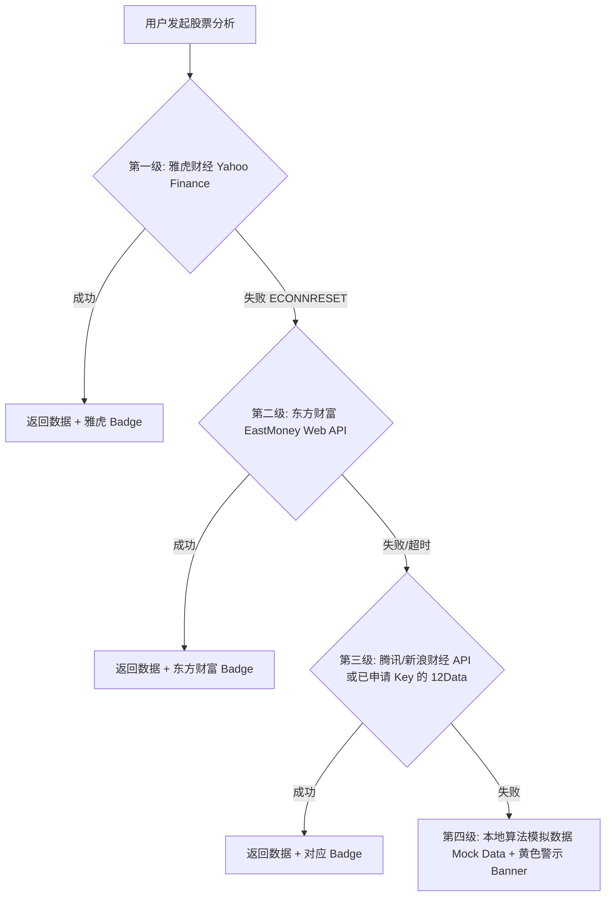

# 备选股票数据 API 调研报告

在开发和运行 **ZenithAnalysis (天顶分析)** 系统过程中，由于部分地区（如中国大陆）的网络环境限制，直连雅虎财经（Yahoo Finance）接口（`query.yahooapis.com` / `finance.yahoo.com`）时，常因 TLS 连接重置或握手超时（`ECONNRESET`）导致接口 500 级崩溃。

为此，系统已集成了**东方财富 (EastMoney)** 接口作为一级防线。本文对目前业界可用的其他免代理、免 Key 或高性价比的备选股票行情 API 进行对比调研，以便系统在未来进行更多元化的多源容灾集成。

---

## 1. 免 Key / 免代理直连 API（国内极速，适合无代理环境）

### 1.1 东方财富 (EastMoney) API（已在系统中部分集成）
* **概览**：东方财富网页端背后的行情接口。
* **数据覆盖**：A股（沪深京）、港股、美股、日股、部分海外股指及外汇。
* **优点**：
  * **完全免 Key**，国内直连延迟极低（通常 < 50ms）。
  * 包含实时与历史日K、周K、月K、分钟K等，支持前复权、后复权。
* **缺点**：非官方公开 API，有潜在的接口格式变动、加解密或防爬虫升级的风险。
* **典型请求 URL**：
  * 获取日 K 线：
    `https://push2his.eastmoney.com/api/qt/stock/kline/get?secid={secid}&fields1=f1,f2,f3,f4,f5,f6&fields2=f51,f52,f53,f54,f55,f56&klt=101&fqt=1&beg=19900101&end=20991231&lmt=300`
  * 获取最新股票报价（包含股票名称）：
    `https://push2.eastmoney.com/api/qt/stock/get?secid={secid}&fields=f58,f43,f170`
* **标识符规则（secid）**：
  * 美股：`105.{Symbol}`（如 `105.AAPL`）
  * 港股：`116.{5位代码}`（如 `116.00700`）
  * 沪市A股：`1.{6位代码}`（如 `1.600519`）
  * 深市A股：`0.{6位代码}`（如 `0.000001`）

### 1.2 腾讯财经 (Tencent Finance) API
* **概览**：腾讯证券/自选股网页端及小程序背后的行情接口。
* **数据覆盖**：A股、港股、美股等。
* **优点**：国内直连极其稳定，速度飞快。
* **缺点**：历史 K 线数据结构较为老旧，且返回格式为腾讯特有的 JSONP 包裹或逗号分隔文本，解析逻辑稍微复杂。
* **典型请求 URL**：
  * 历史日 K 线：
    `https://web.ifzq.gtimg.cn/appnew/tech/historykline/get?symbol={symbol}&type=day&limit=300`
  * 股票标识符（symbol）规则：
    * 沪市：`sh600519`
    * 深市：`sz000001`
    * 港股：`hk00700`
    * 美股：`usAAPL`

### 1.3 新浪财经 (Sina Finance) API
* **概览**：新浪网财经板块背后的行情查询接口。
* **数据覆盖**：A股、港股、美股、期货等。
* **优点**：免 Key，国内网络无需梯子。
* **缺点**：新浪历史 K 线 API 限制较多（单次返回数量有限），且服务器对 Headers（如 `Referer`）有一些校验限制，偶发防爬封锁。
* **典型请求 URL**：
  * 美股历史日 K 线：
    `https://stock.finance.sina.com.cn/usstock/api/jsonp.php/IO.Success/US_MinKLine.getKLine?symbol={symbol}&scale=240&datalen=300`

---

## 2. 国际标准 API（需申请 Key，规范性与商业保障强）

如果后期希望使用更稳定、有官方文档保障、格式极度规范的 API，且能够接受申请免费 API Key 的前提条件，可以参考以下方案：

### 2.1 Twelve Data
* **概览**：专门为开发者设计的全球金融数据 API，支持股票、外汇、加密货币等。
* **数据覆盖**：全球超过 10 万个符号，包含美股、港股、日股、A股。
* **免费额度**：
  * **800 次 / 天**
  * **8 次 / 分钟**（非常适合低频个人研报获取）
* **优点**：
  * 官方提供 Node.js SDK，数据返回格式极为优雅（标准 JSON）。
  * 全球多市场覆盖，A股（使用例如 `600519`）、港股（`0700`）支持极佳。
* **缺点**：国内部分网络直连 Twelve Data 可能会有握手延迟，每分钟 8 次的限制在多端高频访问时容易被触发。
* **典型请求 URL**：
  `https://api.twelvedata.com/time_series?symbol={symbol}&interval=1day&outputsize=300&apikey={YOUR_API_KEY}`

### 2.2 Alpha Vantage
* **概览**：最老牌的免费金融 API 之一，由 Y Combinator 支持。
* **数据覆盖**：全球多市场实时与历史股票、外汇、宏观经济数据。
* **免费额度**：
  * **25 次 / 天**（近年来免费额度被大幅削减，之前为 500 次/天）
* **优点**：
  * 接口极其规范，包含大量技术指标（如 EMA、MACD、RSI）的直接调取接口，不需要自己写算法。
* **缺点**：免费额度极低，25 次/天仅够调试使用，商业或高频使用强制需要付费。
* **典型请求 URL**：
  `https://www.alphavantage.co/query?function=TIME_SERIES_DAILY&symbol={symbol}&outputsize=compact&apikey={YOUR_API_KEY}`

### 2.3 FMP (Financial Modeling Prep)
* **概览**：以美股基本面财务报表、财报电话会议文本以及实时行情见长的 API。
* **免费额度**：
  * **250 次 / 天**（仅限美股，不支持港股/A股等海外市场）
* **优点**：如果只需要做美股，FMP 的历史 K 线和财报数据深度冠绝群雄，响应极快。
* **缺点**：免费版不支持非美股。
* **典型请求 URL**：
  `https://financialmodelingprep.com/api/v3/historical-price-full/{symbol}?timeseries=300&apikey={YOUR_API_KEY}`

---

## 3. 国内量化界常用 Python 级数据源（适合结合后台 Python 服务）

如果系统以后将计算引擎移至 Python 后台（或通过 Node.js 执行 Python 脚本），以下是国内最专业的两家选择：

### 3.1 AkShare（完全开源免费）
* **概览**：基于 Python 的开源财经数据接口库，由国内社区维护。
* **原理**：底层通过爬取新浪财经、东方财富、网易财经等网页接口并清洗归一化。
* **优点**：完全免费、数据极广、开箱即用，国内网络直连。
* **缺点**：只能在 Python 环境中使用。

### 3.2 Tushare（积分制 API）
* **概览**：国内运行多年的金融数据社区。
* **原理**：提供统一的 HTTP API 接口，通过 Token 鉴权。
* **优点**：数据质量极高，由专业团队维护，接口非常稳定。
* **缺点**：需要注册账号，根据积分等级限制接口调用频次和范围，获取高级数据或高频调用需要捐赠（充值）以换取积分。

---

## 4. ZenithAnalysis 系统容灾链进化建议

为了实现绝对的可用性（即便在离线、网络隔离或第三方接口阻断状态下），建议系统可以采用以下**四级渐进容灾策略**：

通过这一层层降级链条，系统可在任何极限网络下都保持 100% 可用，同时优先提供真实度最高的数据。
